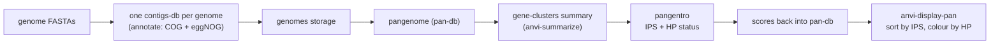

**Information-theoretic triage of hypothetical proteins, built to live inside [anvi'o 9 "eunice"](https://anvio.org).**
 
---
 
## What problem does this solve?
 
You've just built a pangenome, and a frustratingly large fraction of your gene clusters come back annotated as "hypothetical protein" — no function, no family, nothing. A few of them are real biological novelty worth chasing with structure prediction or experiments. Most are not. And here's the catch that makes this genuinely hard: homology-based tools are *silent* on exactly these proteins, by definition. If BLAST or eggNOG-mapper had anything to say about them, they wouldn't be hypothetical in the first place.
 
`pangentro` gives you a way to rank them anyway, without asking any database for permission. For every gene cluster in your pan-db, it looks only at the protein sequences themselves and asks one question: *how unusual is this protein's amino-acid makeup, compared to the rest of your proteome?* It turns the answer into a single number — the **Informational Priority Score (IPS)** — and writes it straight back into your pan-db. You then sort your gene clusters by that score inside `anvi-display-pan`, colour them by hypothetical-protein status, and start working from the top.
 
One caution before anything else: **this is triage, not annotation.** The IPS does not predict function, and it never claims to. All it does is tell you *where to spend a finite budget* of expensive downstream work — AlphaFold or ESMFold, Foldseek, manual curation, pan-GWAS — by pointing you at the proteins that look least like everything else. Read a high IPS as "this one is worth a closer look," never as "this one is important."
 
Throughout, a *gene cluster* (GC) is what anvi'o calls a group of homologous genes collected across your genomes — that's the unit pangentro scores. Here's the shape of the whole thing:
 

 
---
 
## The score, in one minute
 
Three things make a protein "stand out," and pangentro multiplies them together. A gene cluster only floats to the top if it scores on all three at once:
 
- **It uses its amino acids unevenly — but not because it's junk.** A protein that's mostly long runs of a single residue (a low-complexity region) is usually noise, not novelty, so we down-weight it. This is a complexity filter, and it needs no background to compute.
- **Its composition is far from the rest of your proteome.** This is the part that actually does the ranking: how different are this protein's amino-acid frequencies from a reference set of your proteins?
- **It's long enough to trust.** A 30-residue fragment can look "unusual" purely by chance, so short proteins are penalised.
Written out:
 
```
IPS  =  J'  ·  √JSD  ·  (1 − e^(−L/L₀))
```
 
| term | what it measures (in plain terms) | the formal name, if you want it |
| --- | --- | --- |
| `J'` | how *evenly* the 20 amino acids are used, on a 0–1 scale; low for low-complexity proteins | Pielou evenness of the amino-acid composition (a normalised Shannon entropy) |
| `√JSD` | how *far* this protein's amino-acid frequencies sit from a background set of proteins: 0 means identical composition, larger means more divergent. **This is the main ranking driver.** | the square root of the Jensen–Shannon divergence — a true distance (Endres & Schindelin 2003), which here just means it behaves the way you'd want a distance to: symmetric, and zero only for identical composition |
| `1 − e^(−L/L₀)` | a length penalty: proteins much shorter than `L₀` (default 100 aa) get down-weighted | — |
 
If the names in the third column mean nothing to you, ignore that column entirely — the middle column is everything you need to read the output.
 
---
 
## Quickstart
 
Already have an anvi'o pan-db with a gene-clusters summary? Then this is the whole thing:
 
```bash
pangentro integrate \
    --gene-clusters-summary SUMMARY/MYPROJECT_gene_clusters_summary.txt.gz \
    --pan-db MYPROJECT/MYPROJECT-PAN.db \
    -o pangentro_out/ --project-name MYPROJECT --import
 
anvi-display-pan -p MYPROJECT/MYPROJECT-PAN.db -g MY-GENOMES.db
```
 
In the interface, order your gene clusters by `IPS` and colour them by `HP_status`. The hypothetical proteins worth your time rise to the top. No summary yet? The full workflow below builds one for you (or pangentro will, given the pan-db and the genomes storage).
 
---
 
## Install
 
```bash
# inside your anvi'o conda environment (recommended, so the anvi-* commands are on your PATH)
pip install -e ".[stats]"      # the "stats" extra adds scipy + matplotlib, needed for `compare`
# or just the core:
pip install -e .
```
 
This gives you a `pangentro` command. The core needs only `numpy` and `pandas`. The `compare` subcommand additionally needs `scipy` (plus `matplotlib` for its figure). anvi'o itself is optional — you only need it if you want pangentro to run `anvi-summarize` and the imports for you, or to print messages in anvi'o's own terminal style.
 
---
 
## The full workflow
 
### 1 · Everything upstream is plain anvi'o — annotate *before* the genomes storage
 
Make one contigs database per genome, and annotate each one:
 
```bash
# one contigs-db per genome
anvi-gen-contigs-database -f genome_01.fa -o genome_01.db
anvi-run-hmms -c genome_01.db
 
# --- functional annotation ---------------------------------------------------
# COG20 gives you both functions AND the single-letter COG categories that
# pangentro reads to recognise category 'S' (= "function unknown"):
anvi-run-ncbi-cogs -c genome_01.db
 
# eggNOG-mapper: run it on the gene-call amino-acid sequences, then import the result.
anvi-get-sequences-for-gene-calls -c genome_01.db --get-aa-sequences -o g01.faa
emapper.py -i g01.faa --itype proteins -o g01 --cpu 8
#   Convert g01.emapper.annotations into an anvi'o functions table with the columns:
#     gene_callers_id  source  accession  function  e_value
#   Pick a clear `source` name (e.g. EGGNOG) — that name becomes the summary column
#   pangentro auto-detects. (Put the eggNOG COG letters under a source/column whose
#   name ends in CATEGORY, or point pangentro at it later with --category-source.)
anvi-import-functions -c genome_01.db -i g01_functions.txt
```
 
> **Order matters.** Import your functions into each contigs-db *before* you build the genomes storage. anvi'o takes a snapshot of the functions at that moment, so anything you add afterwards simply won't appear in the pangenome summary — and that summary is what pangentro reads.
 
Then build the pangenome and summarise it:
 
```bash
# genomes storage → pangenome → a default collection → summary
anvi-gen-genomes-storage -e external-genomes.txt -o MY-GENOMES.db
anvi-pan-genome -g MY-GENOMES.db -n MYPROJECT
anvi-script-add-default-collection -p MYPROJECT/MYPROJECT-PAN.db -C DEFAULT
anvi-summarize -p MYPROJECT/MYPROJECT-PAN.db -g MY-GENOMES.db \
               -C DEFAULT -o SUMMARY/
```
 
`anvi-summarize` writes `SUMMARY/MYPROJECT_gene_clusters_summary.txt.gz`, which holds amino-acid sequences by default. Leave it that way — do **not** pass `--report-DNA-sequences`. pangentro scores proteins, and it will warn you loudly if it's handed nucleotides by mistake.
 
### 2 · Run pangentro
 
```bash
pangentro integrate \
    --gene-clusters-summary SUMMARY/MYPROJECT_gene_clusters_summary.txt.gz \
    --pan-db MYPROJECT/MYPROJECT-PAN.db \
    --null-draws 200 \
    -o pangentro_out/ --project-name MYPROJECT
```
 
Don't have a summary yet? Hand pangentro the pan-db and the genomes storage, and it will run `anvi-summarize` for you:
 
```bash
pangentro integrate -p MYPROJECT/MYPROJECT-PAN.db -g MY-GENOMES.db \
    --summary-dir SUMMARY/ -o pangentro_out/ --project-name MYPROJECT
```
 
### 3 · Push the results back into the pan-db
 
```bash
anvi-import-misc-data pangentro_out/MYPROJECT_items_for_anvio.txt \
    -p MYPROJECT/MYPROJECT-PAN.db --target-data-table items
anvi-import-collection pangentro_out/MYPROJECT_HP_collection.txt \
    -p MYPROJECT/MYPROJECT-PAN.db -C pangentro_HP
anvi-display-pan -p MYPROJECT/MYPROJECT-PAN.db -g MY-GENOMES.db
```
 
In the interactive interface, **order your items by `IPS` (or `IPS_percentile`) and colour by `HP_status`** to bring the highest-priority hypothetical clusters to the surface. Then click into a gene cluster to inspect its aligned homologues.
 
Passing `--import` to `integrate` runs those three import commands for you. anvi'o has no overwrite flag for items misc-data, so re-running needs `--overwrite`, which first clears pangentro's own layers (via `anvi-delete-misc-data`) before importing them again.
 
---
 
## What it writes
 
| file | what it is |
| --- | --- |
| `*_pangentro_metrics.txt` | the full per-gene-cluster table (every column below) |
| `*_items_for_anvio.txt` | an **anvi'o misc-data-items** file — import this to decorate the pangenome |
| `*_HP_prioritized.txt` | the hypothetical clusters only, sorted by IPS — your triage worklist |
| `*_HP_collection.txt` | an **anvi'o collection** of the top-N hypothetical clusters, binned by HP status |
| `*_run_report.json` | provenance: version, input SHA-256, parameters, environment, counts, QC |
 
The columns you'll actually read in the metrics table:
 
| column | what it tells you |
| --- | --- |
| `pangenome_category` | `core` / `soft_core` / `shell` / `cloud`, based on how many genomes carry the cluster (its *occupancy*). The thresholds are explicit, tunable flags. |
| `IPS_core_mean`, `IPS_core_max`, `IPS_self_mean` | the IPS against the shared background vs. against each gene's own genome (see *Two backgrounds* below) |
| `IPS_percentile` | the cluster's rank from 0–100; usually the cleanest thing to sort by in anvi'o |
| `IPS_core_z`, `IPS_core_emp_p` | the null-model calibration (below) |
| `HP_status` | `ORFan` / `uncharacterized` / `annotated` |
| `efficiency`, `mean_compression_ratio`, `sqrt_JSD_core` | diagnostics |
 
---
 
## Comparing groups — `compare`
 
Once you have the metrics table, `compare` asks the obvious follow-up: *do the IPS values actually differ between pangenome categories (or between HP statuses)?*
 
```bash
pangentro compare -i pangentro_out/MYPROJECT_pangentro_metrics.txt \
    -o cmp/ --group-by pangenome_category        # or: --group-by HP_status
```
 
It runs a Kruskal–Wallis test across all the groups at once — a rank-based test that doesn't assume your numbers are normally distributed, which IPS values aren't. If that's significant, it follows up with pairwise Mann–Whitney U tests (rank-based comparisons between two groups at a time). The pairwise p-values are corrected for the fact that you're running many comparisons at once (Holm–Bonferroni), and each comparison comes with a rank-biserial effect size — a number that tells you *how big* the difference is, not just whether it cleared a significance threshold (positive means the first group tends to score higher). It writes `group_summary.tsv`, `statistical_tests.tsv` (with the corrected `p_adjusted` column), and a box/strip-plot figure (`--no-figure` to skip it). Add `--hypothetical-only` to restrict the whole comparison to hypothetical clusters.
 
---
 
## The thinking behind it
 
This section is the *why*. You don't need any of it to run pangentro — but if the IPS is going into a thesis or a paper, you'll want to be able to defend every choice here.
 
### The null model — turning a score into a significance (`--null-draws N`)
 
A raw IPS is just a magnitude: bigger means more unusual, but unusual *compared to what?* The null model answers that by building a "what would random look like?" baseline for each protein individually.
 
For every gene, pangentro generates `N` synthetic proteins of the *exact same length*, each one assembled by drawing amino acids at random in proportion to how common each residue is in the background (a multinomial draw — no actual sequences are ever written to disk). It scores those random proteins the same way, and reports where your real protein falls against them:
 
- **`IPS_core_emp_p`** — the empirical p-value: the fraction of random proteins that scored at least as high as the real one, computed as `(1 + #{null ≥ obs}) / (N + 1)`. A small value means your protein is more atypical than a *typical* protein of its length would be by chance.
- **`IPS_core_z`** — the z-score: how many standard deviations above the random average your protein sits.
Because the length penalty is identical for your gene and for its length-matched random twins, it cancels out. That's the whole point: the empirical p-value isolates *compositional* atypicality and soaks up the extra sampling noise that short proteins carry (the same noise the length-bias QC warns about). Start with `N = 200`; bump it to `1000` when you're generating a figure. The null is reproducible with `--seed`, and it's computed for `k = 1` (the default — one amino acid at a time).
 
> Why re-draw from the background instead of just shuffling each protein? Because shuffling a protein's residues doesn't change *which* amino acids it contains, and the IPS at `k = 1` only cares about composition. A shuffle would hand you back the same score every time — a useless null. Re-drawing from the background is the comparison that actually means something.
 
### Two ways to define "unusual" — and why it matters
 
"Unusual composition" only means something *relative to a background*, and there are two honest choices for that background. pangentro computes both, because each one buys you something different and each has a catch.
 
- **`IPS_core` — compare every protein to one shared reference.** Here the background is the concatenated core proteome (`--bg-categories`, `core` by default). Because every gene cluster is measured against the same reference, the numbers are directly comparable across your whole pangenome. The catch: a core cluster's own sequences are *part* of that background, so it's partly being compared to itself. That's circular — but circular in the *safe* direction. It pushes core scores down, which only makes it harder for a core gene to look unusual. Better to under-call a core gene than to over-call one.
- **`IPS_self` — compare every protein to its own genome.** Here the background is each gene's own proteome, so there's no cross-genome circularity at all. If your hypothesis is "hypothetical proteins concentrate in the accessory genome," this is the cleaner evidence for it — at the cost of a slightly different reference for each genome, so the values aren't quite as comparable across the board.
Neither one is "the right answer"; they answer slightly different questions. Choose which one decorates anvi'o with `--ips-column`, and if you're writing this up, report both.
 
### What counts as a "hypothetical protein"
 
Whether a protein is "hypothetical" is a statement about our *knowledge*, not about the protein itself — so pangentro defines it operationally, from the annotations actually present, in three tiers:
 
| status | what it means |
| --- | --- |
| `ORFan` | no hit in *any* annotation source you ran — not even a distant one. The strongest candidates for lineage-specific novelty. |
| `uncharacterized` | there's a hit, but only to domains of unknown function (DUFs), "unknown function" / "hypothetical" descriptions, or a weak COG category (`S` by default, set with `--weak-cog-categories`) |
| `annotated` | at least one genuine functional description, or a COG category that isn't weak |
 
A `putative` or `probable` hit counts as **annotated** — "putative ABC transporter" is a real, testable hypothesis about function, not a blank.
 
---
 
## Reproducibility & sensitivity
 
- Every run drops a `*_run_report.json` next to its output, recording the input **SHA-256**, the full parameter set, the package versions, and which anvi'o backend was used. Keep it next to your figures — it's your provenance trail.
- The category thresholds (`--core`, `--soft-core`, `--shell`), the background (`--bg-categories`), `--l0`, and `--weak-cog-categories` are all explicit flags, and they're meant to be *varied* in a sensitivity analysis rather than trusted as defaults.
- `integrate` reports a length-bias QC — the rank correlation (Spearman ρ) between IPS and protein length — and warns you if the length term is starting to dominate the ranking.
---
 
## Development
 
```bash
pip install -e ".[test]"
pytest -q
```
 
CI runs the test suite on Python 3.9 / 3.11 / 3.12 on every push (see [`.github/workflows/ci.yml`](https://github.com/jcmenjr/bioentro-suite/blob/main/.github/workflows/ci.yml)).
 
---
 
## Upgrading from an older version?
 
`pangentro` is now anvi'o-native and eggNOG-mapper-aware from end to end. The old Bakta → Panaroo path (and the `preparo` helper that fed Panaroo) has been removed — pangentro no longer reads Panaroo's `pan_genome_reference.fa`. If you have a v0.3.x project lying around, rebuild it through the anvi'o workflow above; there's a single supported track now. (Full version history lives in the commit log / `CHANGELOG`.)
 
---
 
## License
 
MIT — see [LICENSE](https://github.com/jcmenjr/bioentro-suite/blob/main/LICENSE). Part of **bioentro-suite**.
 